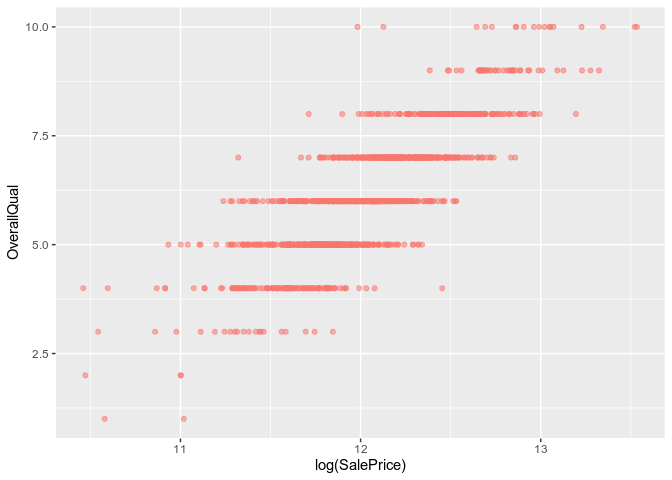
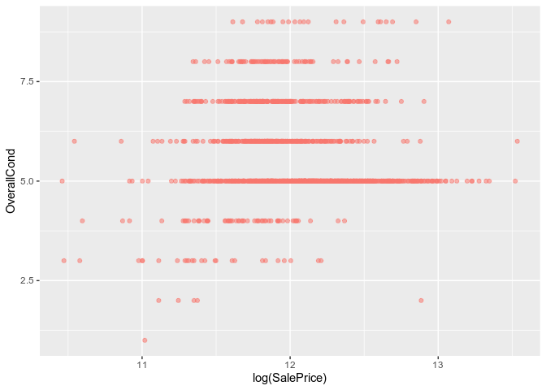
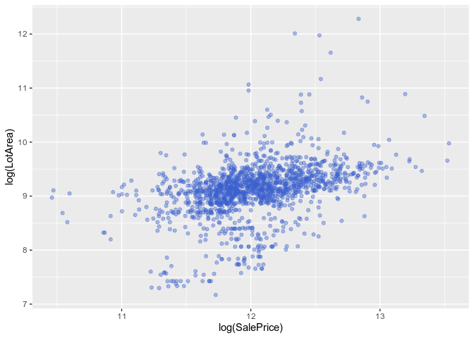
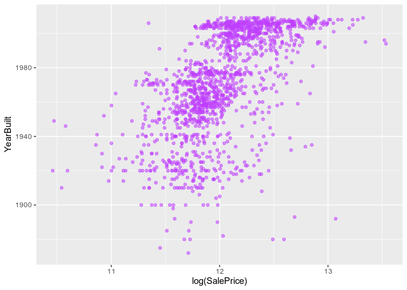
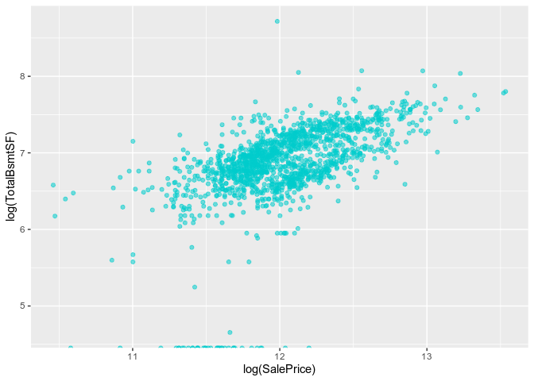

Exploratory House Price Analysis
================

**Based off of Kaggle competition:
<https://www.kaggle.com/c/house-prices-advanced-regression-techniques/overview>**

**Goal:** In this project, we will use linear regression to create a
model that will predict the sale price of houses using a dataset
containing 79 features for each home.

First, we want to look for correlations between variables, to determine
which features will most reliably predict the sale price of a home.

``` r
library(ggplot2)

# Read in the house data
house_data <- read.csv('train.csv')
```

Let’s consider two variables:

  - OverallQual: rating of material of house on a scale of 1-10
  - OverallCond: rating of condition of the house on a scale of 1-10

At a first glance, one would assume these two variables have a positive
relationship with the value of a house. Plotting these two variables
against the sale prices of houses will allow us to see if there is a
general positive
trend.

``` r
ggplot(data=house_data) + geom_point(mapping=aes(x=log(SalePrice), y=OverallQual, color='red', alpha=0.4)) + theme(legend.position = 'none')
```

<!-- -->

As expected, there seems to be a positive relationship between the
overall quality rating of the house and the sale price. In this graph,
the sale price was log transformed to visualize significant percent
changes.

``` r
ggplot(data=house_data) + geom_point(mapping=aes(x=log(SalePrice), y=OverallCond, color='red', alpha=0.4)) + theme(legend.position = 'none')
```

<!-- -->

Overall condition and sale price appear to be roughly correlated, but it
is difficult to give a definitive verdict without further analyses. The
location or size of the house may prove to be more influential than the
overall
condition.

``` r
ggplot(data=house_data) + geom_point(stat='identity',mapping=aes(x=log(SalePrice), y=log(LotArea)), color='royalblue3', alpha=0.4) + theme(legend.position = 'none')
```

<!-- -->

After log transforming the sale price and lot area, one can see that
there is a slight positive correlation between these two
variables.

``` r
ggplot(data=house_data) + geom_point(stat='identity',mapping=aes(x=log(SalePrice), y=YearBuilt, alpha=0.4), color='darkorchid1') + theme(legend.position = 'none')
```

<!-- -->

The same can be seen for the year the house was built and sale price.
This relationship makes sense since older houses are bound to be made
out of lesser quality materials and are most likely in worse conditions
than a newer
home.

``` r
ggplot(data=house_data) + geom_point(stat='identity',mapping=aes(x=log(SalePrice), y=log(TotalBsmtSF), alpha=0.4), color='cyan3') + theme(legend.position = 'none')
```

<!-- -->
